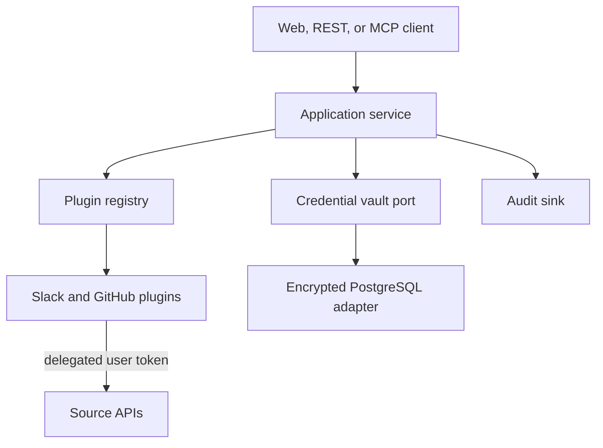

# CompanyBrain

CompanyBrain is a federated, permission-aware company knowledge service for people and AI agents. It queries Slack and GitHub live with each user's delegated OAuth token and exposes the same application core through HTTP, a minimal web UI, and MCP.

## Current scope

- Typed knowledge objects and citations
- Plugin SDK with explicit credential and storage declarations
- Federated search orchestration with partial-failure semantics
- Slack message search and live object retrieval
- GitHub code, issue, and pull-request search with live object retrieval
- Generic OIDC authorization-code login with PKCE
- Slack delegated-user OAuth account linking
- Local-only unauthenticated development mode
- REST API, minimal web UI, and MCP stdio server
- Durable encrypted PostgreSQL credentials, sessions, OAuth state, and audit events

Source content and embeddings are not persisted. Development may use in-memory adapters; production requires PostgreSQL. Delegated tokens are encrypted with AES-256-GCM before persistence, with the subject and source bound as authenticated data. Session and OAuth-state bearer values are stored only as SHA-256 hashes.

## Architecture



The dependency direction is `domain <- plugin-sdk <- application <- runtime <- transports`. Source adapters implement the plugin SDK and never receive an administrator credential from the application.

## Requirements

- Node.js 22+
- pnpm 11 (enable Corepack with `corepack enable`)
- A Slack or GitHub user token, or corresponding OAuth apps

## Run locally

```bash
cp .env.example .env
pnpm install
pnpm build
set -a && source .env && set +a
pnpm start
```

Open `http://localhost:3000`. For the shortest development loop, set `SLACK_USER_TOKEN` and/or `GITHUB_USER_TOKEN`. Without `DATABASE_URL`, tokens remain only in the process-local credential vault.

You can also use Docker:

```bash
CREDENTIAL_ENCRYPTION_KEY="$(openssl rand -base64 32)" docker compose up --build
```

## Slack OAuth setup

Create a Slack app and configure:

- Redirect URL: `http://localhost:3000/oauth/slack/callback`
- User token scopes: `search:read`, `channels:history`, `groups:history`, `im:history`, `mpim:history`
- Environment: `SLACK_CLIENT_ID` and `SLACK_CLIENT_SECRET`

The callback accepts only `authed_user.access_token`; a bot token is not substituted because that could change the authorization principal.

## GitHub OAuth setup

Create a GitHub OAuth app and configure:

- Callback URL: `http://localhost:3000/oauth/github/callback`
- Environment: `GITHUB_CLIENT_ID` and `GITHUB_CLIENT_SECRET`
- Requested scopes: `repo`, `read:org`, and `read:user`

GitHub code, issues, and pull requests are queried with the linked user token. Citation object IDs contain validated repository coordinates rather than arbitrary URLs.

## Generic OIDC setup

Set `AUTH_MODE=oidc` and configure the authorization, token, and userinfo endpoints shown in `.env.example`. The web flow uses authorization code with PKCE, an HttpOnly `SameSite=Lax` session cookie, expiring state, and the provider's userinfo endpoint. API callers may provide an OIDC access token as `Authorization: Bearer …`.

`AUTH_MODE=local` is rejected whenever `NODE_ENV=production`. Production also requires `DATABASE_URL` and a base64-encoded 32-byte `CREDENTIAL_ENCRYPTION_KEY`.

## REST API

```bash
curl -sS http://localhost:3000/api/search \
  -H 'content-type: application/json' \
  -d '{"query":"incident review","sourceIds":["slack","github"],"limit":10}'
```

Routes:

- `POST /api/search`
- `GET /api/object?sourceId=github&objectId=...`
- `GET /api/sources`
- `GET /api/access?sourceId=slack`
- `GET /healthz`

## MCP

Build first, then configure a stdio MCP client:

```json
{
  "mcpServers": {
    "company-brain": {
      "command": "pnpm",
      "args": ["--dir", "/absolute/path/to/CompanyBrain", "mcp"],
      "env": {
        "COMPANY_BRAIN_SUBJECT": "local-mcp-user",
        "SLACK_USER_TOKEN": "xoxp-...",
        "GITHUB_USER_TOKEN": "github_pat_..."
      }
    }
  }
}
```

Tools: `search`, `get_object`, `resolve_citation`, `list_sources`, and `explain_access`.

## Quality gates

```bash
pnpm build
pnpm test
pnpm lint:eslint
pnpm knip
pnpm lint
```

See [the MVP decision record](docs/rfc/0001-company-brain-mvp.md) for the evaluated alternatives, security constraints, and next implementation boundary.
